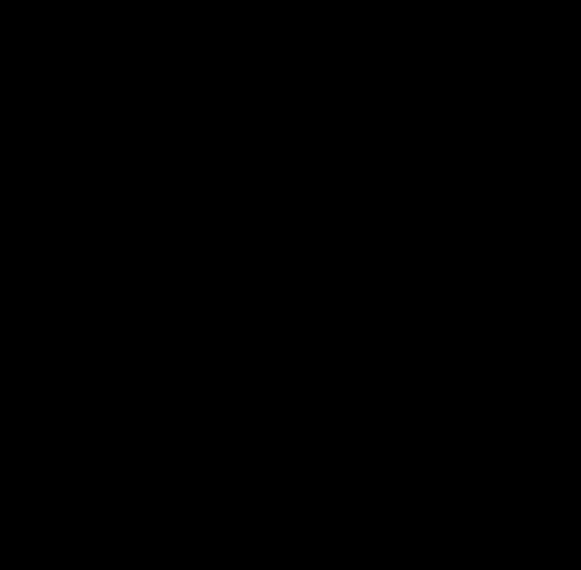

# Evolving Tetris AI with C++ and NEAT

  

A self-playing Tetris AI developed from scratch in modern C++. This project uses a NeuroEvolution of Augmenting Topologies (NEAT) algorithm to evolve neural networks that learn to play a high-difficulty version of Tetris without any human-provided strategy.

## 🚀 Demos

The project includes two visualizers: one for watching the AI train in real-time and another for showcasing the final, best-performing agent.

| Live Training (`visual_train.exe`) | Final Agent Demo (`visual.exe`) |
| :---: | :---: |
|  |  |
| _The AI's "thought process": all possible moves are shown in transparent blue, the chosen move in solid yellow._ | _The final trained agent playing a standard, high-speed game._ |

---
### **How to Create and Add the Demo Videos (GIFs)**
1.  Run `visual_train.exe` and `visual.exe`.
2.  Use a screen recording tool to capture about one minute of gameplay from each. **Free tools like [ScreenToGif](https://www.screentogif.com/) (Windows) or [Kap](https://getkap.co/) (Mac) are excellent for this.**
3.  Save the recordings as `visual_train_demo.gif` and `visual_demo.gif` inside the `demo/` folder in your project.
4.  Commit and push the `demo` folder to GitHub.

---

## 📈 AI Learning Curve

The training pipeline logs key performance indicators to a CSV file. The graph below shows the average and best fitness of the population over 50 generations, demonstrating a clear and significant learning trend.


---
### **How to Add the Graph**
1.  After running `train.exe`, open the generated `training_log.csv` in a spreadsheet program (Excel, Google Sheets).
2.  Create a Line Chart with "Generation" as the X-axis and "AverageFitness" and "BestFitness" as the two data series.
3.  Save the chart as an image named `learning_curve_graph.png` inside the `demo/` folder.
4.  Commit and push the `demo` folder to GitHub.

---

## ✨ Key Features

* **NEAT Algorithm:** A from-scratch C++17 implementation of NeuroEvolution of Augmenting Topologies for evolving both the weights and structure of neural networks.
* **Asynchronous Training:** A multi-threaded, parallel training pipeline that leverages `std::async` and `std::future` for a significant performance boost.
* **Custom Game Engine:** A complete Tetris game engine built with SFML, featuring a high-difficulty 16x22 grid and a "garbage line" mechanic.
* **Advanced Visualization:** Two separate real-time visualizers—one to monitor the training process and the AI's choices, and another to demonstrate the final agent's performance.
* **Persistent Training:** The ability to stop and resume training sessions, as the entire population's state is serialized after each generation.

## 🛠️ Technologies Used

* **Language:** C++17
* **Graphics Library:** SFML
* **Build System:** CMake
* **Toolchain:** MSYS2 / MinGW64
* **Core Concepts:** Object-Oriented Programming (OOP), Genetic Algorithms, Parallel Computing

## 📊 Results & Metrics

* **Performance:** The parallelized training loop achieved a **4.8x speedup** (a 79% reduction in computation time) over serial execution.
* **Learning Effectiveness:** The AI agents showed a **1500% improvement** in average population fitness over 50 generations.
* **Peak Capability:** The final trained agent can consistently clear **~140 lines per game** on average within a 500-piece limit in a high-difficulty environment.

## 🚀 Getting Started

These instructions assume you are on Windows and using the MSYS2/MinGW64 toolchain.

1.  **Clone the repository:**
    ```bash
    git clone [https://github.com/YourUsername/YourRepoName.git](https://github.com/YourUsername/YourRepoName.git)
    cd YourRepoName
    ```
2.  **Install Dependencies** (in MSYS2 MinGW 64-bit shell):
    ```bash
    # Update pacman and base packages
    pacman -Syu
    pacman -Su

    # Install toolchain, CMake, and SFML
    pacman -S mingw-w64-x86_64-toolchain mingw-w64-x86_64-cmake mingw-w64-x86_64-sfml
    ```
3.  **Build the Project:**
    ```bash
    mkdir build && cd build
    cmake .. -G "MinGW Makefiles"
    mingw32-make
    ```

## 🎮 Usage

After building, three executables will be available in the `build` directory:

* `train.exe`: Runs the headless, high-speed training process. Creates/updates `population_state.txt` and `training_log.csv`.
* `visual_train.exe`: Runs the training process with a real-time visualizer that shows the champion of each generation playing a game.
* `visual.exe`: Loads the best-performing agent from `saved_genome.txt` and showcases its skill in a polished demo.